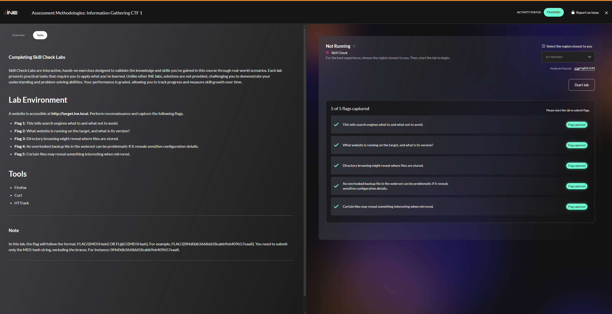

website:

flag 1:

Flag 2:

Flag 3:

Flag 4:

[[https://developer.wordpress.org/advanced-administration/security/backup/#backing-up-your-wordpress-site]]

[[https://duplicator.com/backup-file-extension-list/#:~:text=Common backup file extensions include,\(compressed backups\]]%2C%20and%20.)

looking for wp-config

file extensions this can be saved as?

Flag 5:

httrack

All flags submitted!

